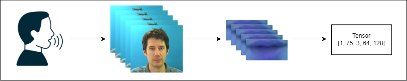

# Visual Speech Recognition and Multilingual Translation Powered by NLP

This repository implements a deep-learning pipeline to recognize words/sentences from silent video of a speaker’s lips. We combine a 3D CNN (ResNet), a CTC-based approach, and optional language model (KenLM) fusion for lip reading.



## Table of Contents
- [Overview](#overview)
- [Dataset](#dataset)
- [Preprocessing](#preprocessing)
- [Model & Architecture](#model--architecture)
- [Language Model Fusion](#language-model-fusion)
- [Commands & Usage](#commands--usage)
- [References](#references)

## Overview
This project aims to perform automatic lip reading on the GRID Corpus by:

1. Extracting lip regions from video using dlib for face detection and extracting lip region.
2. Preprocessing frames into a consistent shape (64×128).
3. Feeding them into a 3D CNN + CTC-based pipeline for sequence modeling.
4. Optionally integrating a language model (KenLM) for shallow fusion.
5. Finally using mBart50 for language translation.

The end result is predicted words from silent video frames, plus optional French or Spanish translations.

## Dataset
We use the GRID corpus, which contains short command-like phrases from multiple speakers:

```
data/raw/
 ├── s1/
 │    ├── videos/*.mpg
 │    └── alignments/*.align
 ├── s2/
 ├── ...
 └── s34/
```

- **Video Files**: .mpg format.
- **Align Files**: Each .align has start/end times and tokens
    ```
    0 23750 sil
    23750 29500 bin
    29500 34000 blue
    34000 35500 at
    35500 41000 f
    41000 47250 two
    47250 53000 now
    53000 74500 sil
    ```
    We skip `sil` for silence.

## Preprocessing
- **Frame Extraction**: We read each .mpg video at 25 FPS.
- **Lip Detection/Cropping**: Use dlib to detect mouth region and crop each frame to 32×64.
- **Normalization**: Convert to grayscale for 3D CNN input.
- **Saving**: We store preprocessed frames as .npy and then used for the training scripts.

## Model & Architecture
### Lip Reading Model
- **3D CNN (ResNet18)**: Extract spatio-temporal features from lip regions.
- **Transformer / CTC**:
    - 3D ResNet + Transformer (encoder-only) with CTC.
- **Positional Encoding**
    Since the **Transformer** requires positional information for each time step, we employ a **sinusoidal positional encoding** as defined in the original Transformer paper. This encoding is added to the feature vectors along the time dimension, enabling the model to learn temporal ordering **without** requiring recurrent connections. 
    In particular:
        - We generate a fixed positional matrix (size = `max_len × d_model`) of sine/cosine patterns.
        - We **add** this matrix to the 3D ResNet’s output embeddings before sending them to the Transformer encoder.
        - This ensures the model can distinguish features from earlier frames vs. later frames in the sequence.

### Optional Language Model
- **KenLM**: n-gram LM for shallow fusion.
- **MBart**: For translation from English to French/Spanish.

## Language Model Fusion
If you want to boost the lip reading accuracy or translate the final text:

### KenLM (Shallow Fusion)
- During decoding, combine CTC log probabilities + alpha × LM log probabilities.
- `combined_score = ctc_score + alpha * lm_score`.

### MBart Translation
- For final text translation to FR or ES, use an MBart model from Hugging Face.

## Commands & Usage
### 1. Preprocessing
```sh
python -m src.preprocessing.save_numpy \
        --data_dir data/raw \
        --output_dir data/processed \
        --resize 32 64
```
Reads videos from `data/raw/sX/videos`, detects lips, resizes to 32×64, saves .npy.

### 2. Training
```sh
python -m src.training.train \
        --data_dir data/processed \
        --checkpoint_dir checkpoints \
        --epochs 50
```
Trains the lip reading model, saving checkpoints to `checkpoints/`.

### 3. Inference (LM Fusion + Translation)
```sh
python -m src.inference.predict_with_translation \
        --video_path data/raw/s1/videos/bbaf2n.mpg \
        --checkpoint checkpoints/epoch_50.pth \
        --kenlm_model 3gram.bin \
        --beam_size 3 \
        --alpha 0.1 \
        --target_lang fr
```
Uses KenLM shallow fusion in beam search, then translates to French.
